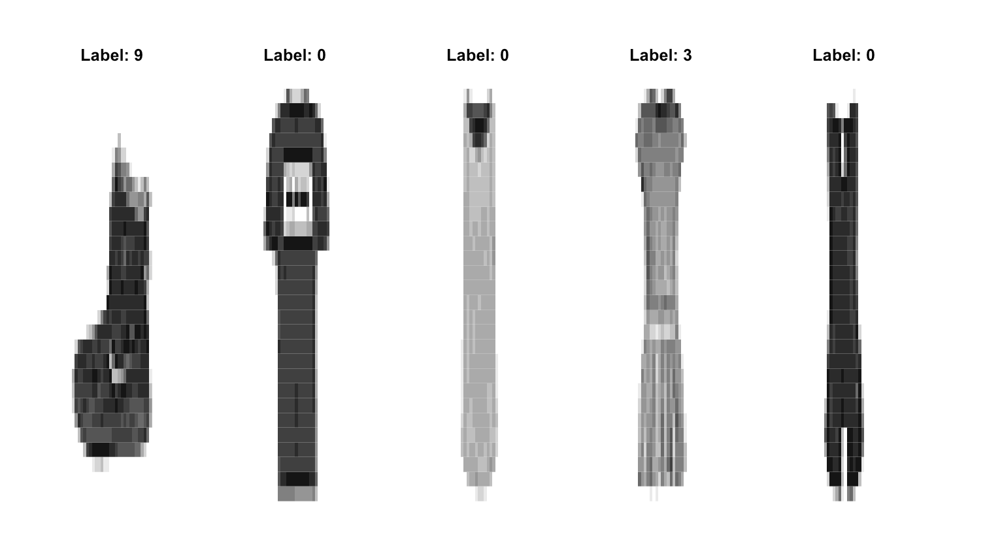

```{r setup, include=FALSE}
knitr::opts_chunk$set(echo = FALSE)
library(ISLR2)
library(MASS)
library(e1071)
library(class)
library(caret)
```

## Problem 1

```{r}
# (a)
full.logit = glm(Direction~Lag1+Lag2+Lag3+Lag4+Lag5+Volume, data=Weekly,family='binomial')
summary(full.logit)
```

```{r}
# (b)
full.prob = predict(full.logit, Weekly, type='response') 
full.pred = rep('Down',dim(Weekly)[1])
full.pred[full.prob >0.5] ='Up' 
full.conf_mat = table(full.pred,Weekly$Direction) 
full.conf_mat
1 - mean(full.pred == Weekly$Direction)
```
(b) The confusion matrix tells that there are 58 'Down' and 557 'Up' that are classified correctly. There are 48 false negative(down) and 430 false positive(up).

```{r}
# (c)
train_data = Weekly[Weekly$Year <= 2008,]
test_data = Weekly[Weekly$Year > 2008,]

train.logit = glm(Direction~Lag2, data=train_data,family='binomial')
summary(train.logit)

test.prob = predict(train.logit, test_data, type='response') 
test.pred = rep('Down',dim(test_data)[1])
test.pred[test.prob >0.5] ='Up' 
test.conf_mat = table(test.pred,test_data$Direction) 
test.conf_mat
1 - mean(test.pred == test_data$Direction)
```

```{r}
# (d)
lda.fit = lda(Direction~Lag2,data=train_data)
lda.fit
lda.pred = predict(lda.fit, newdata = test_data)
lda.class = rep('Down',dim(test_data)[1])
lda.class[lda.pred$posterior[,2]>0.5] = 'Up'
table(lda.class,test_data$Direction)
mean(lda.class!=test_data$Direction)
```

```{r}
# (e)
qda.fit = qda(Direction~Lag2,data=train_data)
qda.pred = predict(qda.fit, newdata = test_data)
table(qda.pred$class,test_data$Direction)
mean(qda.pred$class==test_data$Direction)
```

```{r}
# (f)
nb.fit = naiveBayes(Direction~Lag2, data=train_data)
nb.class = predict(nb.fit, newdata = test_data)
table(nb.class, test_data$Direction)
mean(nb.class == test_data$Direction)
```

## Problem 2

```{r}
heart = read.table('https://hastie.su.domains/ElemStatLearn/datasets/SAheart.data', sep=",",head=T,row.names=1)

# (a)
x = data.frame(age=50)
heart.log = glm(chd~age, data=heart,family='binomial')
heart.log
predict(heart.log, newdata = x, type='response')

# (b)
n = dim(heart)[1]
B = 2000
beta_0 = rep(0,2000)
for(b in 1:B){
  index = sample(1:n,n,replace=TRUE)
  bootsample = heart[index,]
  fit = glm(chd~age,data=bootsample, family = 'binomial')
  pred = predict(fit, newdata = x, type='response')
  beta_0[b] = pred
}

sqrt(sum((beta_0-mean(beta_0))^2)/(B-1))
```

## Problem 3

Linear discriminant function (training set):   
$d_0(X_1) = X_1 * (3.4/4) - (3.4^2/2*4) + log(0.32)$    
$d_1(X_1) = X_1 * (5.1/4) - (5.1^2/2*4) + log(0.68)$

Linear discriminant function (test set):   
$d_0(X_1) = X_1 * (3.2/4.5) - (3.2^2/2*4.5) + log(0.35)$    
$d_1(X_1) = X_1 * (5.5/4.5) - (5.5^2/2*4.5) + log(0.65)$

Based on the function of the test set, if $d_0(X_1)$ gives a higher value than $d_1(X_1)$, then the test observation will be assigned to Y=0. Otherwise if $d_1(X_1) > d_0(X_1)$, the test observation will be assigned to Y=1.

## Problem 4

#(Refer to 'HW10(Q4-5).R' for Problem 4 and 5 codes)

(a)   
[1] 0.08000845 0.08533290 0.08335070 0.09066961   
Optimal K: 1    
    knn.pred    
testY  0  1  2  3  4  5  6  7  8  9   
    0  7  0  0  0  0  0  0  0  0  0   
    1  0  7  0  0  0  0  0  0  0  0   
    2  0  0  7  0  0  0  0  0  0  0   
    3  0  0  0 12  0  0  0  0  0  0   
    4  0  0  0  0 13  0  0  0  0  2   
    5  0  0  0  0  0 10  0  0  0  0   
    6  0  0  0  0  0  0  9  0  0  0   
    7  0  0  0  0  1  0  0  5  0  0   
    8  0  0  0  1  0  2  0  1 10  0   
    9  1  0  0  0  2  0  0  0  0 10   
[1] 0.1

```{r}
# (b)
#lda(y~x,data=train)

# Error in lda.default(x, grouping, ...) : 
#  variables   1   2   3   4   5   6   7   8   9  10  11  12  17  18  19  20  21  22  23  24  25  26  27  28  29  30  31  32  53  54  55  56  57  58  83  84  85  86 112 113 141 142 169 477 561 645 646 672 673 674 700 701 702 728 729 730 731 755 756 757 758 759 760 781 782 783 784 appear to be constant within groups
```

(b) The error that shows from performing lda is that some variables appear to be constant within groups. Those columns of train$x have a single value, in this case all 0's, so they do not provide any discriminatory information for classification.

(c) The dataset, consisting of handwritten digit images, have complex decision boundaries that cannot be well approximated by linear methods as shown in LDA. KNN, being a non-parametric method, does not make assumptions about the underlying data distribution and can capture complex decision boundaries. KNN can perform well in high-dimensional spaces, as it relies on distance metrics to find nearest neighbors.

## Problem 5

(a) 

(b)    
[1] 0.2130025 0.1986714 0.1990069 0.1983458   
Optimal K: 9    
     knn.pred   
testY  0  1  2  3  4  5  6  7  8  9   
    0  3  0  0  0  0  0  0  0  0  0   
    1  0  8  0  0  1  0  0  0  0  0   
    2  1  0 10  0  1  0  2  0  0  0   
    3  0  0  0  7  2  0  0  0  0  0   
    4  1  0  2  0  8  0  1  0  0  0   
    5  0  0  0  0  0  5  0  2  0  2   
    6  2  0  1  0  1  0  3  0  0  0   
    7  0  0  0  0  0  0  0 14  0  0   
    8  0  0  1  0  0  0  1  0  7  0   
    9  0  0  0  0  0  0  0  0  0 14   
[1] 0.21

The misclassification rate of the fashion dataset is a little higher than the digit dataset, most probably because the fashion images are more complicated.