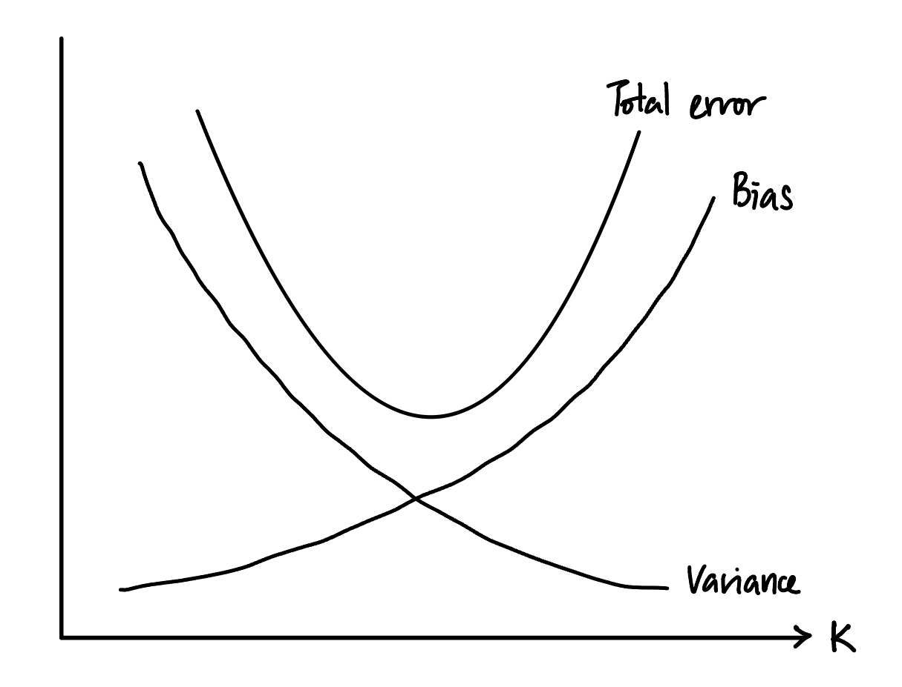

```{r setup, include=FALSE}
knitr::opts_chunk$set(echo = TRUE, results = "hold")
library(ROCR)
library(MASS)
library(caret)
library(class)
```

## Problem 1

a. Yhat = -6 + 0.05(X1) + 1(X2)   
X1 = 40, X2 = 3.5   
Yhat = -6 + 0.05\*40 + 1\*3.5   
P(Y=1) = exp(Yhat) / (1 + exp(Yhat)) = 0.3775407   
The probability of the student getting A is approximate 0.378.    
ii. P(Y=1) = 0.5    
log(0.5 / (1 - 0.5)) = -6 + 0.05\*X1 + 1\*3.5   
X1 = (6-3.5) / 0.05 = 50    
The student needs to study for 50 hours.

b. If true decision boundary between two groups is linear and the constant variance assumption holds, LDA will most likely perform better on the testing set because LDA tends to have lower variance than QDA due to its assumption of equal covariance matrices for all classes, which makes it less flexible and more stable when the sample size is limited.

c. It is most likely unknown if LDA or QDA will perform better on the training set. However, LDA might have a slight advantage due to its simplicity and lower risk of overfitting compared to QDA, especially with limited training data.

d. (i) LDA might be more suitable in this case as the data is about height and weight of the two genders, which most likely will have a perfect separation. LDA is capable of handling linear decision boundary.    
(ii) Logistic regression will be a suitable choice due to its ability to handle binary classification and the data does not seem to have substantial separation between the two classes.    
(iii) KNN will be more suitable as it is capable of capturing complex, non-linear decision boundaries and might perform well in this scenario. 

## Problem 2

a. When K=1, we only consider the one closest neighbor to the test observation. In this case the closest neighbor is training observation 2, as it has the lowest distance, meaning it is the closest. So, we would classify our test observation to Y=1.

b. When K=3, consider 3 closest neighbor by choosing 3 with the lowest distance. They will be training observations 2, 4, and 1. Among these neighbors, two of them are labeled 0 and the other one is labeled 1. Since the majority class is 0, we would classify our test observation to Y=0.

c. As K increases, the classifier becomes less flexible because larger values of K result in smoother decision boundaries, as they incorporate more neighbors into the decision-making process. At very small values of K, the bias is low but the variance is high. As K increases, bias increases due to the smoothing effect of considering more neighbors, but variance decreases as the model becomes more stable and less sensitive to individual data points.    


## Problem 3

```{r}
spam = read.csv("./spambase/spambase.data",header=FALSE)
spam$V58 = as.factor(spam$V58)

train = sample(1:nrow(spam),nrow(spam)/2, replace=FALSE)
test = (-train)

train_data = spam[train,]
test_data = spam[test,]

prop_train_spam = sum(train_data$V58 == 1) / nrow(train_data)
cat("Proportion of spam emails in training set:", prop_train_spam, "\n")
cat("Proportion of non-spam emails in training set:", 1-prop_train_spam, "\n")

# Check proportions in testing set
prop_test_spam = sum(test_data$V58 == 1) / nrow(test_data)
cat("Proportion of spam emails in testing set:", prop_test_spam, "\n")
cat("Proportion of non-spam emails in testing set:",1- prop_test_spam, "\n")
```

a. In this case, false positive might be more critical. Reporting a meaningful email as spam might result in important emails being overlooked or filtered out, potentially causing inconvenience or missing out on important information. 

```{r}
# (b)
glm.fit = glm(V58~., data=spam,subset=train,family='binomial')
glm.prob = predict(glm.fit,test_data,type='response') 

ROCRpred = prediction(glm.prob,test_data$V58)
plot(performance(ROCRpred,'tpr','fpr'),colorize=TRUE, print.cutoffs.at=seq(0,1,by=0.05), text.adj=c(-0.2,1.7))
```

```{r}
# (c)
glm.pred = rep(0,length(test))
glm.pred[glm.prob >0.5] = 1
conf_matrix = table(glm.pred,test_data$V58) 
conf_matrix
glm_fpr = conf_matrix[2,1] / sum(conf_matrix[,1])
glm_fnr = conf_matrix[1,2] / sum(conf_matrix[,2])
cat("False positive rate:", glm_fpr, "\n")
cat("False negative rate:", glm_fnr, "\n")
```

```{r}
# (d)
perf = performance(ROCRpred,'tpr','fpr')
thresholds = data.frame(threshold = perf@alpha.values[[1]],fpr = perf@x.values[[1]], tpr = perf@y.values[[1]])
fpr0.03 = subset(thresholds,fpr<0.03)
optimal = min(fpr0.03$threshold)
optimal
glm.pred2 = rep(0,length(test))
glm.pred2[glm.prob > optimal] = 1
conf_matrix2 = table(glm.pred2,test_data$V58) 
conf_matrix2
glm_fpr2 = conf_matrix2[2,1] / sum(conf_matrix2[,1])
cat("False positive rate with adjusted threshold:", glm_fpr2)
```

```{r}
# (e)
lda.fit = lda(V58~.,data=spam, subset=train)
lda.prob = predict(lda.fit,test_data)
lda.ROCRpred = prediction(lda.prob$posterior[,2],test_data$V58)
plot(performance(lda.ROCRpred,'tpr','fpr'),colorize=TRUE, print.cutoffs.at=seq(0,1,by=0.05), text.adj=c(-0.2,1.7))

lda.pred = rep(0,length(test))
lda.pred[lda.prob$posterior[,2] >0.5] = 1
lda.conf_matrix = table(lda.pred,test_data$V58) 
lda.conf_matrix
lda_fpr = lda.conf_matrix[2,1] / sum(lda.conf_matrix[,1])
lda_fnr = lda.conf_matrix[1,2] / sum(lda.conf_matrix[,2])
cat("LDA false positive rate: ", lda_fpr, "\n")
cat("LDA false negative rate: ", lda_fnr, "\n")

lda.perf = performance(ROCRpred,'tpr','fpr')
lda.thresholds = data.frame(threshold = lda.perf@alpha.values[[1]],fpr = lda.perf@x.values[[1]], tpr = lda.perf@y.values[[1]])
lda.fpr0.03 = subset(lda.thresholds,fpr<0.03)
lda.optimal = min(lda.fpr0.03$threshold)
lda.optimal
lda.pred2 = rep(0,length(test))
lda.pred2[lda.prob$posterior[,2] > lda.optimal] = 1
lda.conf_matrix2 = table(lda.pred2,test_data$V58) 
lda.conf_matrix2
lda_fpr2 = lda.conf_matrix2[2,1] / sum(lda.conf_matrix2[,1])
cat("New false positive rate: ", lda_fpr2)
```

```{r}
# (f)
trainX = scale(train_data[, -ncol(train_data)])
testX = scale(test_data[, -ncol(test_data)])
trainY = train_data$V58
testY = test_data$V58

flds = createFolds(spam$V58, k=5, list = TRUE, returnTrain = FALSE)
K =  seq(1, 20, by = 1) 
cv_error = matrix(NA, 5, length(K))

for (j in 1:length(K)) {
  k = K[j]
  for (i in 1:5) {
    test_index = flds[[i]]
    trainX_flds = scale(spam[-test_index, -ncol(train_data)])
    testX_flds = scale(spam[test_index, -ncol(test_data)])
    
    trainY_flds = spam$V58[-test_index]
    testY_flds = spam$V58[test_index]
    
    knn.pred = knn(trainX_flds, testX_flds, trainY_flds, k=k)
    cv_error[i,j] = mean(testY_flds != knn.pred)
  }
}

optimal_k = K[which.min(apply(cv_error,2,mean))]
cat("Optimal K:", optimal_k, "\n")
knn.pred = knn(trainX, testX, trainY, k=optimal_k)
table(knn.pred, testY)
mean(testY != knn.pred)
```

g. By comparing the false positive rates from all 3 classifiers, logistic regression has the lowest false positive rate, indicating that it is better at correctly identifying non-spam emails. Therefore, logistic regression might be more suitable as we aim to reduce false positives.