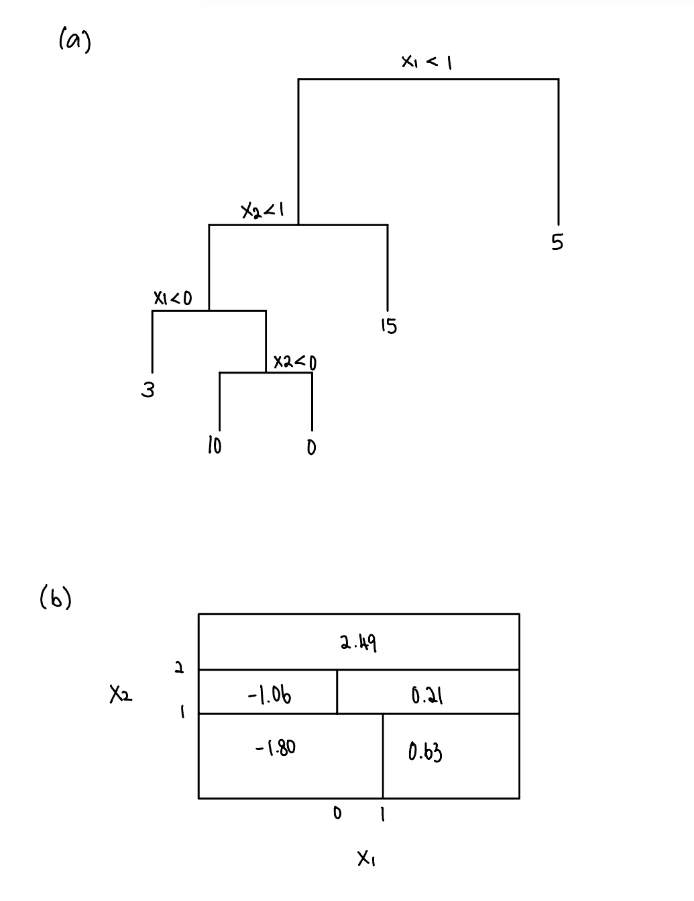

```{r setup, include=FALSE}
knitr::opts_chunk$set(echo = TRUE, results = "hold")
library(ISLR2)
library(tree)
library(randomForest)
library(caret)
set.seed(7)
```

## Problem 1



```{r}
# (c)
train_index = sample(1:nrow(OJ),800)
train_OJ = OJ[train_index,]
test_OJ = OJ[-train_index,]
```

```{r}
# (d)
tree.OJ = tree(Purchase~., data = train_OJ, split = "deviance")
tree.sum = summary(tree.OJ)
tree.sum
training.err = tree.sum$misclass[1]/tree.sum$misclass[2]
cat("\nTraining error:", training.err, "\n")
cat("Terminal nodes:", tree.sum$size)
```

```{r}
# (e)
plot(tree.OJ)
text(tree.OJ,pretty=0)
```

e. The plot shows a decision tree with branches indicating the splits made based on predictor variables. Each terminal node represents a subset of the data where a prediction is made.

```{r}
# (f)
tree.pred = predict(tree.OJ, newdata=test_OJ, type = "class")
table(tree.pred, test_OJ$Purchase)
```

```{r}
# (g)
cv.OJ = cv.tree(tree.OJ)
plot(cv.OJ$size,cv.OJ$dev,type='b')
```

```{r}
# (h)
min_error_tree_size = cv.OJ$size[which.min(cv.OJ$dev)]
min_error_tree_size
prune.OJ = prune.tree(tree.OJ, best = min_error_tree_size)
```

```{r}
# (i)
unpruned_train_error = tree.sum$misclass[1]/tree.sum$misclass[2]
prune.tree.sum = summary(prune.OJ)
pruned_train_error = prune.tree.sum$misclass[1]/prune.tree.sum$misclass[2]
cat("Unpruned train error:",unpruned_train_error,"\n")
cat("Pruned train error:",pruned_train_error,"\n")
```

i. In this case, the pruned tree has a slightly higher training error rate than the unprune tree. This result might seem unexpected because pruning typically aims to reduce overfitting and improve generalization performance, which would ideally result in a lower training error for the pruned tree compared to the unpruned one. However, pruning primarily affects the complexity of the tree, and its impact on the training error might not always be substantial, especially if the original tree was not heavily overfitting the training data.

```{r}
# (j) test errors rates
unpruned_test_error = sum(tree.pred != test_OJ$Purchase) / nrow(test_OJ)
tree.prune = predict(prune.OJ,newdata=test_OJ, type = "class")
pruned_test_error = sum(tree.prune != test_OJ$Purchase) / nrow(test_OJ)
cat("Unpruned test error:",unpruned_test_error,"\n")
cat("Pruned test error:",pruned_test_error,"\n")
```

j. In this case, the pruned tree has a higher test error rate than the unpruned tree. While it's unexpected for the pruned tree to have a slightly higher test error rate as pruning is generally expected to improve generalization performance, it's not entirely surprising considering the complexities involved in pruning decision trees and the nature of randomness.

## Problem 2

```{r}
# (a)
Carseats$High = factor(ifelse(Carseats$Sales <=8, "No", "Yes"))
train_idx = sample(1:nrow(Carseats),nrow(Carseats)/2)
train_Carseats = Carseats[train_idx,]
test_Carseats = Carseats[-train_idx,]
```

```{r}
# (b)
tree.carseats = tree(High~.-Sales, data=train_Carseats, split = c("gini"))
summary(tree.carseats)
plot(tree.carseats)
text(tree.carseats,pretty=0)

# Training misclassification error
train.pred = predict(tree.carseats, train_Carseats, type = "class") 
mean(train.pred != train_Carseats$High)

# Test misclassification error
test.pred = predict(tree.carseats, test_Carseats, type = "class")
mean(test.pred != test_Carseats$High)
```

```{r}
# (c)
cv.carseats = cv.tree(tree.carseats, FUN = prune.misclass)

optimal = which.min(cv.carseats$dev)
opt.size = cv.carseats$size[optimal]
cat("Optimal size tree:", opt.size,"\n")
prune.carseats = prune.tree(tree.carseats,best=opt.size)

# Test error for pruned tree
tree.pred2 = predict(prune.carseats, test_Carseats, type = "class")
mean(tree.pred2 != test_Carseats$High)
```

```{r}
# (d)
B = 500
bag.carseats = randomForest(High~.-Sales, data=train_Carseats, importance = TRUE, ntree=B)
yhat.bag =  predict(bag.carseats, newdata = test_Carseats, type = "class") 
# Test error
mean((yhat.bag != test_Carseats$High)^2)

# Variable importance
importance(bag.carseats)
```

```{r}
# (e)
m_values = 1:10
test_errors_rf = numeric(length(m_values))
for (m in m_values) {
  rf_model = randomForest(High ~ .-Sales, data = train_Carseats, mtry = m, importance = TRUE, ntree = 500)
  rf_pred = predict(rf_model, newdata = test_Carseats, type = "class")
  test_errors_rf[m] = mean((rf_pred != test_Carseats$High)^2)
}

# Create a table of test errors for different values of m
data.frame(M = m_values, Test_Error = test_errors_rf)
```

f. It would not be appropriate to choose the value of m that gives the smallest test error. Selecting the value of m based solely on the test error can lead to overfitting to the test set.

```{r}
# (g)
ctrl = trainControl(method = "cv", number = 5)
rf_model = train(High ~ .-Sales, data = train_Carseats, method = "rf", trControl = ctrl, tuneGrid = data.frame(mtry = m_values))

optimal_m = rf_model$bestTune$mtry
cat("Optimal m value:", optimal_m, "\n")
```

